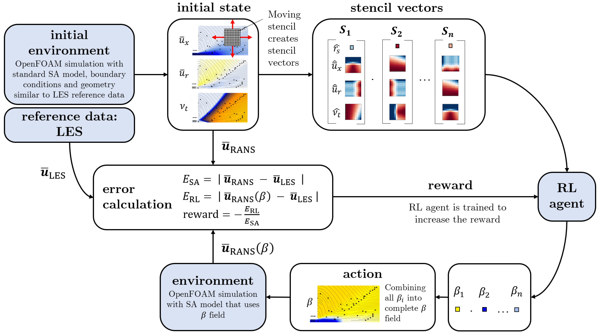

# Deep Reinforcement Learning augmented Spalart-Allmaras Turbulence Model: Application to a turbulent round jet flow

This repository contains the code that was used for the journal publication 

[Fuchs, L.M.; von Saldern, J.G.R.; Kaiser, T.L.; Oberleithner, K. Deep Reinforcement Learning-Augmented Spalart–Allmaras Turbulence Model: Application to a Turbulent Round Jet Flow. Fluids 2024, 9, 88. https://doi.org/10.3390/fluids9040088 ](https://doi.org/10.3390/fluids9040088)

The purpose of this work is to explore the potential of deep reinforcement learning (DRL) as a black-box optimizer for turbulence model identification. For this, we consider a Reynolds-averaged Navier–Stokes (RANS) closure model of a round turbulent jet flow at a Reynolds number of 10,000. For this purpose, we augment the widely utilized Spalart–Allmaras turbulence model by introducing a source term that is identified by DRL. The algorithm is trained to maximize the alignment of the augmented RANS model velocity fields and time-averaged large eddy simulation (LES) reference data.

The objective of the DRL algorithm is to find a function that maps mean flow quantities to the source term in the Spalart–Allmaras transport equation and that minimizes the difference in velocity fields between the RANS and the reference LES mean field. To identify the 𝛽-function that leads to a good alignment of the RANS solution with the LES mean field, proximal-policy-optimization (ppo) is used. The algorithm is used in a single-step open-loop design. Figure 1 shows an overview of the methodology.

Figure 1: Overview of the optimization methodology (Figure 4 in Fuchs et. al, 2024)

## Content of the Repository
This repository contains the following parts: 
- OpenFOAM source files to modify Spalart-Allmaras Code (`templates/openfoamCore`)
- OpenFOAM baseline case (Re = 10,000 and 15,000) with and without converged mean fields (initial state) (`templates/openfoam`)
- Code to train DRL algorithm (`run_training.py`)
- Code to rerun baseline simulation (`baseline_run.py`)
- Code to run a pretrained agent (for example for extrapolation tests) (`run_pretrained_agent.py`)

The repository does not contain the LES mean field reference data that is required to fully run the code. It can only be made available upon request. 

## Requirements:
To fully run the training to replicate the data published in Fuchs et. al, 2024 you need three components: 

1. OpenFOAM: The code was developed using OpenFOAM version 4.X. https://openfoamwiki.net/index.php/Installation/Linux/OpenFOAM-4.x/Ubuntu#Ubuntu_18.04. If other Openfoam versions are used the code and templates (open foam case as well as openfoam source files) need to be adjusted. The openFoam Case files can be found here: `templates/openfoam`, the openfoam source files (that need to be compiled) are here: `templates/openfoamCore`
2. Reference Data: The mean field data that is used in the publication can be made available upon request. 
3. Python Packages: To run the code, you need to install all required packages.

This code only works with OpenFOAM 4.x. The most recent compatible Ubuntu version is Ubuntu 18.04. The LES mean field reference data is required to run the code. This data is not included in the repository. 

## Installation

1. Install Ubuntu 18.04
2. Install OpenFOAM 4.x (https://openfoamwiki.net/index.php/Installation/Linux/OpenFOAM-4.x/Ubuntu#Ubuntu_18.04)
3. Install python 3.8.12 (https://stackoverflow.com/questions/69973969/how-to-install-python-3-8-12-on-usr-bin-python)

    `add-apt-repository ppa:deadsnakes/ppa`

    `apt update`

    `apt install python3.8`

4. install the venv version 

    `sudo apt-get install python3.8-venv`
   
5. change default python version:
    open bashrc: `gedit ~/.bashrc`

    add alias `python='/usr/bin/python3.8'` to bashrc

6. Install the local environment for the repository
    - Run the command `source install_env.sh` in a Terminal. This script will create an empty local environment called *local-env*. Then all required modules will be installed using the *requirements.txt* file. The folder containing all installed modules will be placed in the current folder (the contend will not be tracked by git).
    - Your IDE should identify the environment and activate it

## Usage Guide

### Perform Algorithm Training
- in the `scripts/` folder there are several bash scripts, that use absolute pathes. Here you need to specify your own absolute pathes. The scripts run openFoam commands and recompile openFOAM source code.
- you might need to make the scripts executable by changing file permission to grant execution rights
- change the config file `config/run_training.json` 
    You need to specify the path to the LES mean field vtk file:

    "path_to_les_results": "/YOUR_PATH_TO_REFERENCE_DATA/DATA.vtk",

    You need to specify the path to the openFoam source code

    "path_to_openfoam_core": "/YOUR_PATH/OpenFOAM/OpenFOAM-4.x/",

- Run the training script by passing the config file as argument. 
- In a terminal, run the following command: (You migh need to replace the `.` with the absolute path to the code)
    `./local-env/bin/python ./run_training.py "./config/run_training.json"`
### Apply pretrained agent
- after a training run is completed, the best performing agent will be saved in the export folder. The path to the agent needs to be specified in the config:
- in the config file `config/run_pretrained_agent.conf`, change the settings `path_to_agent` and `path_to_les_results`
- run `./local-env/bin/python ./apply_agent.py `
- the path to the config that the script will use, is hardcored in `./apply_agent.py`
### Run Baseline Simulation
- If mesh or boundary conditions shall be changed, a new set of initial simulation results (also called initial state) has to be created. For this task, the script `./baseline_run.py` can be used.

